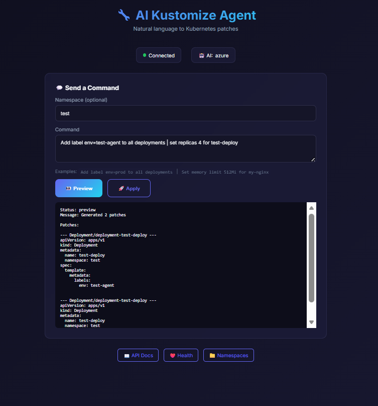
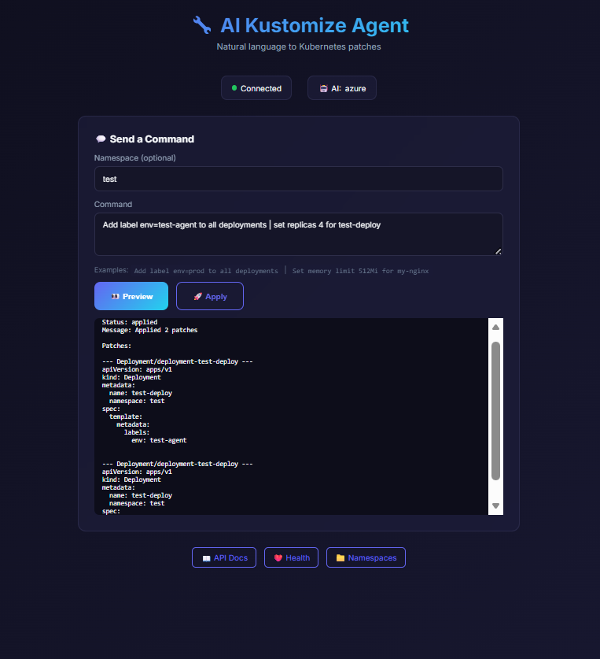

# 🔧 AI Kustomize Agent

**An intelligent agent that uses AI to generate Kustomize patches for bulk Kubernetes resource modifications.**

[]()
[]()
[]()
[]()
[]()
[]()

---

## 🖥️ Web UI Dashboard

The agent now includes a **premium web dashboard** for managing Kubernetes resources visually!

### 📸 Screenshots

| Preview Patches | Apply Changes |
|-----------------|---------------|
|  |  |

### Features:
- 💬 **Chat Interface** - Type natural language commands
- 📋 **Live Patch Preview** - See YAML diffs before applying
- 🎯 **Namespace Selector** - Target specific namespaces
- 🚀 **One-Click Apply** - Execute changes instantly
- 🌙 **Dark Mode** - Premium glassmorphism design

### Run the Web UI:
```bash
# Start API server
cd src && python -m api.server

# Start frontend (in another terminal)
cd web && npm run dev
```

Open `http://localhost:5173` in your browser.


## 🎯 The Problem

DevOps engineers frequently need to make bulk changes to Kubernetes resources:
- *"Add resource limits to all deployments"*
- *"Update all images to use private registry"*
- *"Add security context to all pods"*

**Current approach:** Manually edit dozens of YAML files or write complex patches.

**This agent:** Describe what you want in plain English → Get Kustomize patches automatically.

---

## ✨ How It Works

```
┌─────────────────────────────────────────────────────────────────┐
│ "Update image to v2, add label env=prod & set memory to 1Gi"   │
│                                ↓                                │
│           [AI Intent Parser] - Splits into 3 intents            │
│                                ↓                                │
│           [Cluster/File Scanner] - Find target resources        │
│                                ↓                                │
│           [Patch Generator] - Create & Merge patches            │
│                                ↓                                │
│           [Preview] - Show consolidated diff per resource      │
│                                ↓                                │
│           [Apply/Export] - Execute or generate overlay          │
└─────────────────────────────────────────────────────────────────┘
```

---

## 💬 Example Commands

### 📦 Deployment Level (Controlled via Spec Template)
```bash
# Update container image
python -m main --apply --yes "Update image of test-deploy to nginx:1.16.0"

# Set resource limits
python -m main --apply --yes "Set memory limit to 512Mi for test-deploy"

# Scale replicas
python -m main --apply --yes "Scale test-deploy to 3 replicas"

# Add labels to the template (for pod selection)
python -m main --apply --yes "Add label tier=frontend to test-deploy"
```

### 📍 Pod Level (Direct Resource Modification)
```bash
# Add label directly to a pod
python -m main --apply --yes "Add label role=debugging to test-pod"

# Add annotation to a pod
python -m main --apply --yes "Add annotation debug-level=high to test-pod"
```

### 🚀 Complex Multi-Action Commands (The Agent's Power)
The agent automatically splits these into multiple intents and generates a single clean patch.
```bash
# Multiple modifications to a single deployment
python -m main --apply --yes \
  "Update nginx to v1.16, add label env=prod, and set CPU limit to 500m for my-nginx"

# Bulk changes across multiple resources
python -m main --apply --yes \
  "Add label team=devops and set memory limit 128Mi to all deployments in staging"
```

---

## 🛠️ Features

| Feature | Description |
|---------|-------------|
| **Natural Language** | Describe changes in plain English |
| **Multi-Intent** | Support for multiple actions in one request (e.g., "Add label AND set memory") |
| **Deep Patch Merging**| Consolidates multiple modifications into a single strategic merge patch |
| **Multi-Resource** | Deployments, Standalone Pods, Services, ConfigMaps, etc. |
| **Cluster Mode** | Scan and modify live Kubernetes resources |
| **File Mode** | Work with local YAML manifests |
| **Export Mode** | Generate Kustomize overlays (GitOps ready) |
| **Auto-Approval** | Use `--yes` flag to skip interactive prompts in scripts |

---

## 🚀 Usage Guide

### Install Dependencies
```bash
pip install -r requirements.txt
```

### Configure
Edit `.env` or set environment variables:
```bash
AZURE_OPENAI_API_KEY=your_key
AZURE_OPENAI_ENDPOINT=https://your-endpoint.openai.azure.com/
AI_PROVIDER=azure  # or 'gemini'
```

### Command Flags
| Flag | Short | Description |
|------|-------|-------------|
| `--apply` | | Actually execute the changes on the cluster |
| `--yes` | `-y` | Skip confirmation prompt (required for non-interactive use) |
| `--export` | | Path to export Kustomize overlay files |
| `--verbose`| `-v` | Show detailed logs and patch merging steps |
| `--mode` | | `cluster` (live) or `file` (local) |
| `--namespace`| `-n` | Restrict search to a specific namespace |

### In-Cluster Execution (via POD)
If the agent is running in your cluster, you can trigger it from your terminal:
```bash
kubectl exec deployment/ai-kustomize-agent -n devops-tools -- \
  bash -c "cd /app && PYTHONPATH=/app/src python -m main --mode cluster --namespace agent-test --apply --yes 'Add label test=true to test-deploy'"
```

---

## 🔐 Access Configuration

### Mode 1: File Mode (No Cluster Access)
```bash
ai-kustomize --mode file --path ./k8s-manifests "..."
```

### Mode 2: Kubeconfig (Local Development)
```bash
# Uses default kubeconfig
ai-kustomize --mode cluster "..."

# Specific context
ai-kustomize --context staging-cluster "..."
```

### Mode 3: Service Account (In-Cluster)
Deploy with appropriate RBAC:
```bash
kubectl apply -f deploy/rbac.yaml
kubectl apply -f deploy/deployment.yaml
```

### Mode 4: Token Auth (CI/CD)
```bash
export KUBE_API_SERVER="https://api.cluster.example.com"
export KUBE_TOKEN="eyJhbGciOiJSUzI..."
ai-kustomize --api-server $KUBE_API_SERVER --token $KUBE_TOKEN "..."
```

---

## 📁 Project Structure

```
ai-kustomize-agent/
├── src/
│   ├── main.py              # CLI entry point
│   ├── agents/
│   │   ├── intent_parser.py # AI intent understanding
│   │   └── patch_generator.py
│   ├── scanners/
│   │   ├── cluster_scanner.py
│   │   └── manifest_scanner.py
│   ├── transformers/
│   │   ├── deployment.py
│   │   ├── pod.py
│   │   ├── service.py
│   │   └── common.py
│   └── outputs/
│       ├── kustomize.py
│       └── diff.py
├── config/
│   ├── access.yaml          # Access configuration
│   └── templates.yaml       # Patch templates
├── deploy/
│   ├── rbac.yaml
│   └── deployment.yaml
├── examples/
│   ├── add-resource-limits/
│   ├── update-images/
│   └── add-security-context/
├── requirements.txt
├── Dockerfile
└── README.md
```

---

## 📋 Output Examples

### Generated Kustomization
```yaml
# kustomization.yaml
apiVersion: kustomize.config.k8s.io/v1beta1
kind: Kustomization

resources:
  - ../../base

patches:
  - path: patches/deployment-api-limits.yaml
  - path: patches/deployment-web-limits.yaml
  - path: patches/deployment-worker-limits.yaml
```

### Generated Patch
```yaml
# patches/deployment-api-limits.yaml
apiVersion: apps/v1
kind: Deployment
metadata:
  name: api
  namespace: staging
spec:
  template:
    spec:
      containers:
        - name: api
          resources:
            limits:
              memory: "512Mi"
              cpu: "500m"
```

---

## 🛡️ Safety Features

| Feature | Description |
|---------|-------------|
| **Dry Run Default** | Changes are previewed, not applied |
| **Namespace Filtering** | Restrict to specific namespaces |
| **Protected Namespaces** | Block kube-system, production by default |
| **Confirmation Prompt** | Manual approval before apply |
| **Audit Logging** | All actions logged |
| **Rollback** | Undo last changes |

---

## 🤝 Freelance Services

Need custom Kubernetes automation?

- **Custom Transformers:** Support for CRDs and custom resources
- **GitOps Integration:** Auto-commit to ArgoCD/Flux repos
- **Policy Engine:** Enforce organizational standards

[**Contact Me**](mailto:prashantmurtale@gmail.com)

---

## 📄 License

MIT License
